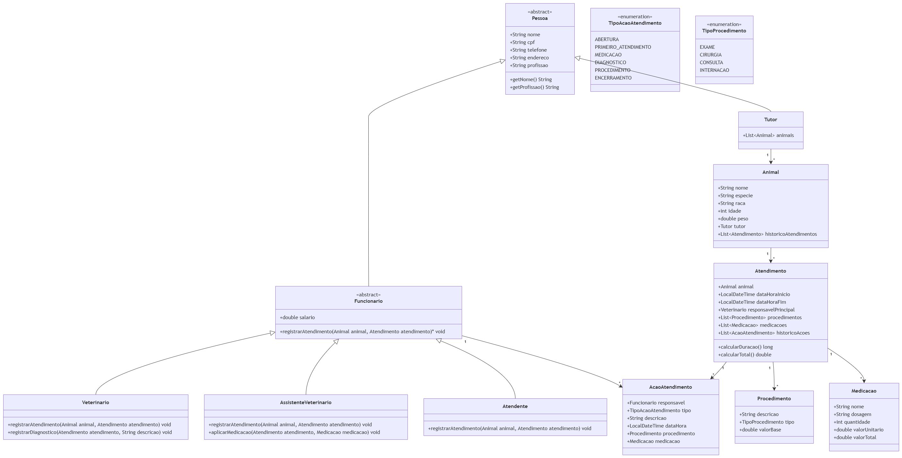

# PataSync-
🐾PataSync – Sistema de Clínica Veterinária

PataSync é um sistema de cadastro e acompanhamento de atendimentos em uma clínica veterinária. Ele registra tutores, animais, profissionais da clínica e todo o histórico clínico de cada atendimento.
Tecnologias

    Linguagem: Java

    Banco de dados: PostgreSQL (database patasync)

    Ferramentas: VS Code com extensão PostgreSQL, psql

Modelo de dados (resumo)

    pessoa: dados gerais de pessoas (nome, CPF, contato, endereço).

    tutor: indica quais pessoas são tutores (clientes) da clínica.

    funcionario: vincula pessoas ao papel de funcionário, com salário e tipo (ATENDENTE, VETERINARIO, ASSISTENTE_VETERINARIO).

    assistente_veterinario: especializa funcionários que atuam como assistentes de veterinário.

    animal: cadastro de animais, sempre ligados a um tutor.

    medicamentos: catálogo de medicamentos usados na clínica (nome, princípio ativo, classe, dosagem, valor, observações).

    procedimentos: catálogo de consultas, exames, cirurgias e procedimentos de enfermagem.

    atendimentos: cada consulta/internação do animal, com veterianário responsável, tipo de atendimento e datas.

    medicacoes_aplicadas: registro das medicações aplicadas durante um atendimento.

    procedimentos_realizados: registro dos procedimentos executados em cada atendimento.

    acoes_atendimento: trilha de ações dentro de um atendimento (triagem, diagnóstico, medicação, procedimento, encerramento), ligadas ao profissional e, opcionalmente, à medicação/procedimento.

Como rodar o banco de dados

    Crie o banco patasync no PostgreSQL.

    Execute os scripts .pgsql na pasta db para criar todas as tabelas.

    Use os scripts de INSERT para popular dados iniciais de pessoas, tutores, funcionários, animais, medicamentos e procedimentos.

    Acompanhe e teste consultas usando o painel POSTGRESQL EXPLORER no VS Code ou o psql.

Visão geral do sistema

Este projeto implementa um sistema de cadastro e gerenciamento de atendimentos de uma clínica veterinária, seguindo os critérios de um estudo de caso orientado a objetos: diversidade de entidades, relacionamentos complexos, uso de herança, composição, agregação, polimorfismo, persistência e interação com o usuário.
O foco principal é manter uma ficha completa de cada animal e seu tutor, além de um histórico detalhado dos atendimentos, incluindo quem realizou cada ação, quais procedimentos e medicações foram aplicados, datas, duração e valores financeiros envolvidos.
Modelagem de pessoas e funcionários

A classe Pessoa é abstrata e representa qualquer pessoa cadastrada na clínica, centralizando atributos comuns como nome, CPF, telefone, endereço e profissão.
A partir dela, são especializadas duas categorias principais: Funcionario (também abstrata) e Tutor. Funcionario adiciona informações específicas de colaboradores da clínica (como salário) e define o método abstrato registrarAtendimento(Animal, Atendimento), que é implementado de forma polimórfica pelas subclasses.

Sobre Funcionario, o sistema define três tipos concretos:

    Veterinario: responsável por diagnósticos, procedimentos complexos e plano de tratamento; registra atendimentos e diagnósticos no histórico.

    AssistenteVeterinario: realiza funções simples como triagem inicial, registro de primeiro atendimento e aplicação de medicações.

    Atendente: cuida da abertura e encerramento dos atendimentos, cadastro administrativo de animais e tutores e demais atividades de recepção.

O polimorfismo aparece quando o sistema trabalha com referências de Funcionario e chama registrarAtendimento(...), permitindo que cada tipo de funcionário execute ações diferentes sem alterar o código cliente.
Tutor, animal e histórico de atendimentos

Tutor herda de Pessoa e mantém uma lista de animais sob sua responsabilidade, representando o dono do(s) paciente(s).
Animal contém dados como nome, espécie, raça, idade e peso, além de uma referência ao Tutor e uma lista de Atendimento que compõe o histórico completo daquele paciente dentro da clínica.

A classe Atendimento representa uma internação ou consulta: ela associa um Animal a um período (data/hora de início e fim) e a um veterinário responsável principal, além de manter listas de Procedimento, Medicacao e AcaoAtendimento relacionadas.
Métodos como calcularDuracao() e calcularTotal() permitem obter a duração exata do atendimento e o custo total baseado nos procedimentos e medicações registrados.
Procedimentos, medicações e ações de atendimento

Para organizar os custos e operações clínicas, o sistema define duas entidades principais:

    Procedimento: descreve um procedimento realizado (exame, cirurgia, consulta, internação) com um tipo (TipoProcedimento, enum) e um valor base.

    Medicacao: registra informações sobre medicamentos aplicados (nome, dosagem, quantidade, valor unitário e valor total calculado).

O histórico detalhado de tudo que acontece em um atendimento é mantido pela classe AcaoAtendimento.
Cada ação possui um Funcionario responsável, um tipo (TipoAcaoAtendimento, enum com valores como ABERTURA, PRIMEIRO_ATENDIMENTO, MEDICACAO, DIAGNOSTICO, PROCEDIMENTO, ENCERRAMENTO), uma descrição, a data/hora da realização e, opcionalmente, uma referência direta ao Procedimento ou Medicacao correspondente.
Isso garante que seja possível saber exatamente quem fez cada ação, qual tipo de ação foi, qual procedimento ou medicação esteve envolvido e em que momento ocorreu, atendendo ao requisito de histórico explícito e detalhado.
Relacionamentos principais

Os relacionamentos foram modelados para explorar agregação e composição:

    Um Tutor pode possuir vários Animal.

    Cada Animal possui um histórico composto por múltiplos Atendimento.

    Cada Atendimento contém listas de Procedimento, Medicacao e AcaoAtendimento, que existem vinculadas ao atendimento (caracterizando composição).

    Funcionários (Veterinario, AssistenteVeterinario, Atendente) são responsáveis por várias AcaoAtendimento, reforçando o vínculo entre pessoas e operações registradas no sistema.

Essa modelagem serve como base para a implementação em Java utilizando os conceitos de POO exigidos no projeto: classes abstratas, herança, polimorfismo, composição/agregação e uso de enums para controlar tipos de ações e procedimentos

Estrutura atual do domínio (models)

O sistema está organizado em um pacote br.com.patasync.models que concentra todas as classes de domínio da clínica veterinária, seguindo o diagrama de classes UML e os critérios de POO do projeto.
Esse pacote inclui a hierarquia de pessoas/funcionários, os modelos de paciente e atendimento, além das entidades clínicas de procedimento, medicação e histórico de ações.
Hierarquia de pessoas e funcionários

    Pessoa (abstrata)
    Representa qualquer pessoa cadastrada na clínica (tutor ou funcionário).
    Atributos principais:

        Dados pessoais: nome, cpf (armazenado com dígitos), dataNascimento, sexo, estadoCivil.

        Contato: telefone, email.

        Endereço detalhado: logradouro (rua/avenida), numero, complemento (opcional), cep, cidade, estado (UF).

        Profissão: profissao.
        Encapsulamento feito por meio de construtor completo e getters/setters para todos os campos.

    Funcionario (abstrata, extends Pessoa)
    Especializa Pessoa para representar colaboradores da clínica.
    Atributo adicional: salario : double.
    Não contém mais lógica de negócio; funciona como base de dados para as subclasses concretas (Atendente, AssistenteVeterinario, Veterinario), que usam os mesmos campos de pessoa e acrescentam o salário.

    Subclasses concretas de Funcionario

        Veterinario
        Representa o médico veterinário responsável por diagnósticos e procedimentos clínicos.

        AssistenteVeterinario
        Representa o profissional que auxilia o veterinário, podendo realizar triagem inicial e aplicar medicações.

        Atendente
        Representa o colaborador responsável pela recepção, abertura e encerramento de atendimentos.

    As três subclasses compartilham toda a estrutura de Pessoa (dados pessoais, contato, endereço, profissão) e Funcionario (salário), mantendo a hierarquia bem definida.

    Tutor (extends Pessoa)
    Representa o dono do animal.
    Atributo: List<Animal> animais, com métodos para adicionar/remover animais, mantendo o vínculo entre tutor e seus pacientes.
    No fluxo de cadastro, a data de nascimento é usada para calcular a idade; apenas tutores maiores de idade (18 anos ou mais) são aceitos como responsáveis, reforçando uma regra de negócio importante.

Essa hierarquia demonstra uso de herança e classes abstratas como base de especialização, com dados pessoais padronizados para todas as pessoas do sistema.
Paciente e atendimento

    Animal
    Atributos: nome, especie, raca, idade, peso, tutor, historicoAtendimentos.
    Mantém um List<Atendimento> com todo o histórico clínico daquele animal, permitindo consultar atendimentos passados diretamente a partir da ficha do paciente.
    Possui método para adicionar novos atendimentos à lista, reforçando a relação entre paciente e seus registros clínicos.

    Atendimento
    Atributos:

        animal : Animal

        dataHoraInicio : LocalDateTime

        dataHoraFim : LocalDateTime

        responsavelPrincipal : Veterinario

        procedimentos : List<Procedimento>

        medicacoes : List<Medicacao>

        historicoAcoes : List<AcaoAtendimento>
        Métodos:

        calcularDuracaoEmMinutos() usa Duration.between para calcular a duração da internação/consulta em minutos.

        calcularTotal() soma o valor base de todos os Procedimento e o valor total de todas as Medicacao, gerando o custo total do atendimento.

Essa estrutura garante que cada atendimento tenha informações completas do paciente, do veterinário responsável, dos procedimentos e medicações aplicados, além de um histórico detalhado de ações e custos.
Procedimentos, medicações e histórico de ações

    TipoProcedimento (enum)
    Valores: EXAME, CIRURGIA, CONSULTA, INTERNACAO.
    Usado em Procedimento para classificar o tipo de procedimento clínico realizado.

    Procedimento
    Atributos: descricao, tipo : TipoProcedimento, valorBase.
    Representa qualquer procedimento clínico (exames, cirurgias, consultas, internações) com um custo associado, que entra no cálculo total do atendimento.

    Medicacao
    Atributos: nome, dosagem, quantidade, valorUnitario, valorTotal.
    valorTotal é calculado automaticamente como quantidade * valorUnitario e recalculado sempre que quantidade ou valor unitário são alterados, garantindo consistência dos custos.

    TipoAcaoAtendimento (enum)
    Valores: ABERTURA, PRIMEIRO_ATENDIMENTO, MEDICACAO, DIAGNOSTICO, PROCEDIMENTO, ENCERRAMENTO.
    Classifica o tipo de ação registrada no atendimento (administrativa, clínica ou de encerramento), facilitando filtros e relatórios.

    AcaoAtendimento
    Atributos:

        responsavel : Funcionario (pode ser Veterinario, AssistenteVeterinario ou Atendente)

        tipo : TipoAcaoAtendimento

        descricao : String

        dataHora : LocalDateTime

        procedimento : Procedimento (opcional)

        medicacao : Medicacao (opcional)
        Cada ação descreve explicitamente quem realizou, o tipo de ação, o momento e, quando aplicável, qual procedimento ou medicação esteve ligada àquela ação, permitindo um histórico clínico e financeiro bem detalhado.

Conceitos de POO já aplicados

    Herança: Pessoa → Funcionario, Tutor; Funcionario → Veterinario, AssistenteVeterinario, Atendente.

    Classes abstratas: Pessoa e Funcionario não são instanciadas diretamente; servem como base de especialização para tipos concretos de pessoas no sistema.

    Composição: Atendimento compõe listas de Procedimento, Medicacao e AcaoAtendimento que só existem vinculadas a um atendimento, reforçando o vínculo clínico e financeiro.

    Enums: TipoProcedimento e TipoAcaoAtendimento garantem conjuntos fechados de tipos, facilitando validação, filtros e exibição das operações na interface.

Além disso, as regras de negócio relacionadas ao registro de atendimentos (abertura, triagem, medicação, diagnóstico, procedimentos e encerramento) foram centralizadas na classe de serviço AtendimentoService, mantendo as models focadas em dados e relacionamentos enquanto a lógica de operações é orquestrada em um ponto único.